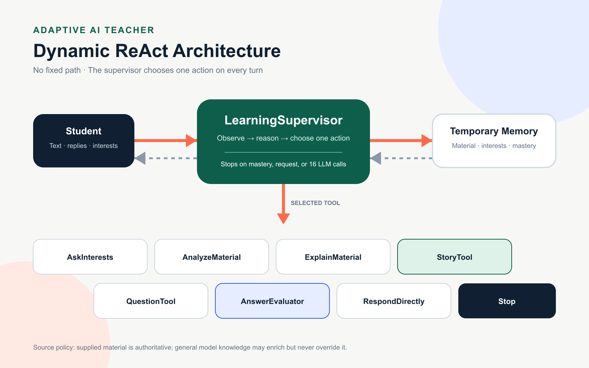

# Executive summary

Adaptive AI Teacher is a conversational ReAct agent designed to personalize the learning of plain-text educational material. Instead of following a predefined sequence, a central `LearningSupervisor` examines the current conversation, temporary learning state, remaining LLM budget, and previous tool results. It then selects the single most useful action for the current turn.

The working application includes a responsive web interface, the four API endpoints required by the course assignment, a complete LLM execution trace, temporary session memory, a 16-call LLM limit, and verified LLMod text and embedding clients. Supabase, Pinecone retrieval, and the final Vercel deployment remain pending.

# Problem and objective

Traditional learning material can be long, dense, abstract, and disconnected from a student's interests. A single explanation style is unlikely to work equally well for every learner. The project addresses this mismatch by adapting explanations, stories, questions, and feedback to the learner's current needs.

The objective is to build an autonomous teaching agent that:

- accepts learning material as plain text;
- maintains a continuous learning conversation;
- discovers student interests initially or gradually;
- selects teaching actions dynamically;
- evaluates answers and identifies weak topics;
- decides when mastery has been reached;
- stays within a strict model-call budget; and
- exposes every LLM call for inspection and grading.

# Current implementation status

## Completed

- Responsive learning interface with conversation history.
- Dynamic `LearningSupervisor` decision logic.
- Eight consistent supervisor actions and tool names.
- Temporary in-memory state with one-hour expiry.
- Hard limit of 16 total LLM calls per session.
- Full step trace with module, prompts, and structured response.
- Required team, agent-information, architecture, and execution endpoints.
- LLMod chat integration using `MB5R2CF-azure/gpt-5.4-mini`.
- LLMod embedding integration using `MB5R2CF-azure/text-embedding-3-small`.
- Verified 1,536-dimensional embedding output.
- Production build, TypeScript validation, and ESLint validation.
- GitHub repository on the `main` branch.

## Pending

- Supabase schema and primary database connection.
- Pinecone index and vector operations.
- Text chunking, embedding upsert, and semantic retrieval.
- Session namespace deletion and expiry cleanup in Pinecone.
- Final team email values.
- Vercel environment configuration and production deployment.

# System architecture



The system consists of four main layers:

1. **Web interface.** Accepts the student's text and replies, displays the agent response, shows the remaining call budget, and renders the complete execution trace.
2. **HTTP API.** Validates requests, resolves the temporary session, invokes the agent, and returns the exact assignment response schema.
3. **ReAct agent.** The `LearningSupervisor` chooses one action based on the latest observation and current state.
4. **Model and data services.** LLMod provides text generation and embeddings. Supabase and Pinecone will provide database and retrieval functionality when connected.

# Dynamic decision model

There is no fixed learning workflow. On each student turn, the `LearningSupervisor` selects exactly one of the following actions.

## AskInterests

Discovers or refines the student's interests through a concise, natural question. It can be selected at the beginning of a session or later when additional personalization would improve the lesson.

## AnalyzeMaterial

Identifies the main subjects and concepts in newly supplied text. In the completed RAG version, this action will also retrieve relevant source chunks from Pinecone.

## ExplainMaterial

Creates a clear explanation at the student's apparent level, prioritizing weak or recently discussed topics.

## StoryTool

Transforms relevant learning content into a memorable story connected to known student interests.

## QuestionTool

Generates targeted questions about the full material or specific weak topics.

## AnswerEvaluator

Compares the student's answer with the supplied material, provides feedback, assigns a score when useful, and updates strong topics, weak topics, and mastery.

## RespondDirectly

Returns a direct response without invoking another teaching tool. This action is useful when the supervisor can answer within its existing decision call or when only one model call remains.

## Stop

Ends the learning process when the model determines that mastery is sufficient, the student requests an end, no useful action remains, or the 16-call limit requires termination.

# Temporary learning state

The current session state contains:

- the authoritative learning material;
- discovered student interests;
- identified topics;
- weak and strong topics;
- recent student and teacher messages;
- the last selected action;
- total LLM calls used; and
- the last update timestamp.

State is held in server memory and expires after one hour. A reset endpoint deletes the current state and clears the session cookie. This design matches the current requirement for temporary memory, but it is best effort on serverless infrastructure because a Vercel function instance may be recycled at any time.

# Source-of-truth policy

The supplied learning material is authoritative for the session. The language model may use general knowledge to provide examples, analogies, or clarification, but it must not silently replace the source material. If the source and general model knowledge conflict, the source material wins.

This rule appears in the supervisor prompt and every tool prompt. It is intended to reduce unsupported answers and ensure that questions and evaluations remain grounded in the student's material.

# LLM call management

The maximum is 16 total LLM calls per session.

- Each `LearningSupervisor` decision counts as one call.
- Each selected LLM-backed tool counts as one additional call.
- State updates and deterministic application logic do not count.
- When no calls remain, the server returns a deterministic stop message without contacting LLMod.

The system normally consumes two calls on a turn: one supervisor decision and one tool execution. When the remaining budget is too small for another tool call, the supervisor is instructed to select `RespondDirectly` or `Stop` and provide the complete response within its decision.

# LLMod integration

The project uses the course LLMod gateway at `https://api.llmod.ai`.

## Text generation

- Endpoint: `/v1/chat/completions`
- Model: `MB5R2CF-azure/gpt-5.4-mini`
- Output format: structured JSON
- Timeout: 120 seconds

## Embeddings

- Endpoint: `/v1/embeddings`
- Model: `MB5R2CF-azure/text-embedding-3-small`
- Verified dimensions: 1,536
- Planned Pinecone metric: cosine similarity

Both integrations were tested successfully with the course API key. Automated tests do not make live LLMod calls because those calls consume the assignment budget.

# API contract

## GET /api/team_info

Returns the batch and order identifier, team name, and the names and email addresses of all students.

## GET /api/agent_info

Returns the agent description, purpose, recommended prompt template, example prompt, full example response, and a complete example execution trace.

## GET /api/model_architecture

Returns the architecture diagram as a PNG image. All module names in the image match the names returned in execution traces.

## POST /api/execute

Accepts a JSON object with one required `prompt` field. A successful response contains exactly these top-level fields:

```json
{
  "status": "ok",
  "error": null,
  "response": "Agent response",
  "steps": []
}
```

An error response contains the same four fields with `status` set to `error`, a human-readable `error`, a null `response`, and an empty `steps` array.

Call usage and session identifiers are returned through HTTP headers so the required JSON schema remains unchanged.

# Environment and secret management

The project uses two different environment files:

- `.env.local` contains real local secrets and configuration. It is ignored by Git.
- `.env.example` contains variable names and safe example values only. It helps teammates configure a new clone and defines the variables that must later be added to Vercel.

The application never loads `.env.example`. It exists only as configuration documentation. The API key is used exclusively by server-side code and is never sent to the browser.

# Local development and validation

Install dependencies and start the development server:

```bash
npm install
npm run dev
```

Open `http://localhost:3000`.

Run the complete non-billable validation suite:

```bash
npm test
```

The test command performs a production build, TypeScript validation, and ESLint validation. LLMod connectivity is tested separately and intentionally, because each live request consumes the project budget.

# Planned Supabase and Pinecone design

## Supabase responsibilities

Supabase will be the primary database for document metadata and any records that must survive a single server process. The exact persisted scope should remain minimal because the product requirement specifies temporary learning memory.

## Pinecone responsibilities

Pinecone will store vectorized learning-material chunks. The planned index uses 1,536 dimensions and cosine similarity. Each temporary learning session will use a separate namespace.

The intended retrieval process is:

1. Receive plain-text learning material.
2. Split the material into bounded, overlapping chunks.
3. Generate embeddings with the LLMod embedding model.
4. Upsert vectors and source metadata under the session namespace.
5. Embed the current retrieval query.
6. Retrieve the most relevant chunks.
7. Provide only those chunks to the selected teaching tool.
8. Delete the namespace when the session is reset or expires.

# Vercel deployment plan

The final application will be deployed on Vercel from the GitHub repository. Before deployment:

1. Complete Supabase and Pinecone integrations.
2. Add all required secret values to Vercel Environment Variables.
3. Deploy the `main` branch.
4. Verify the root GUI without authentication.
5. Verify all four required API endpoints in production.
6. Confirm that `/api/execute` completes within the 300-second limit.
7. Keep the Vercel account and deployment active until grading is complete.

# Security and operational considerations

- Do not commit `.env.local` or any API key.
- Keep LLMod, Supabase, and Pinecone credentials server-side.
- Limit prompt context to relevant state and retrieved chunks.
- Avoid unnecessary model calls to preserve the project budget.
- Treat execution traces as potentially sensitive because they contain complete prompts and model responses.
- Delete temporary vector namespaces when they are no longer required.
- Validate every external-service error and return a human-readable API error.

# Remaining work checklist

- Complete all team email values.
- Create and configure Supabase.
- Create a 1,536-dimension Pinecone index using cosine similarity.
- Implement chunking, upsert, retrieval, and deletion.
- Connect retrieved chunks to `AnalyzeMaterial` and downstream tools.
- Add production environment variables in Vercel.
- Deploy and test the production application.
- Update this documentation with final service identifiers and the production URL.
